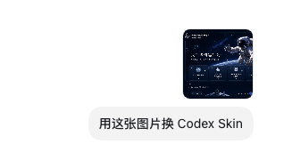

# Codex Skin

  <strong>中文</strong> · <a href="./README.en.md">English</a>

  <strong>给 Codex Desktop 换上一张真正属于你的皮肤。</strong> 
  用一张图片生成主页横幅与任务背景，同时保留原生侧栏、项目选择和输入框。

  非官方社区项目 · 仅通过本机回环 CDP 工作 · 不修改 <code>.app</code>、<code>app.asar</code> 或代码签名。

## 微信交流

<table align="center">
  <tr>
    <td align="center">
       
      微信群：扫码加入交流
    </td>
    <td align="center">
       
      个人微信：添加时请备注“Codex Skin”
    </td>
  </tr>
</table>

## 30 秒开始

### macOS（完整版本）

在 Codex 对话中直接说：

> 安装 Codex Skin

之后无需打开终端或双击桌面文件，继续用自然语言操作即可：

   
  发一张图片，说一句话，剩下的安装、保存与应用流程交给 Skill。

- “用这张图片换 Codex Skin”
- “列出已安装皮肤”
- “切换到「星航员」皮肤”
- “验证当前皮肤并截图”
- “恢复 Codex 官方外观”

Skill 会自动完成安装、主题保存、应用和验证；确实需要重启 Codex 时会先征得确认。桌面的 `Codex Skin.command` 仍会随安装创建，但只是离线或手动操作的备用入口。

> macOS 安装后引擎位于 `~/.codex/codex-dream-skin-studio`，你的图片、主题状态与日志保存在 `~/Library/Application Support/CodexDreamSkinStudio`。换肤流程不会读取或改写 Codex 的 `config.toml`。

### Windows（同样支持 Skill）

安装仓库提供的 `codex-skin-skill` 插件后，也可以直接在 Codex 对话中说：

- “安装 Codex Skin”
- “用这张图片创建并应用 Windows 皮肤”
- “列出已安装的 Windows 皮肤”
- “切换到「主题名」皮肤”
- “验证当前皮肤”
- “恢复 Codex 官方外观”

Skill 会直接执行 [`windows/`](./windows/) 下的安全脚本；需要关闭并重启已运行的 Codex 时会先确认。无需用户自己打开 PowerShell，脚本命令只作为手动排障入口保留。

## 你会得到什么

- **原生可交互**：侧栏、建议卡、项目选择、任务内容与输入框仍是官方原生控件，不是整窗截图。
- **一图一主题**：选一张图片即可生成横幅和低干扰任务背景；随时可以再次换图。
- **可验证、可恢复**：提供验证截图和一键恢复入口，不把你锁在某个主题里。
- **安全边界明确**：CDP 只监听 `127.0.0.1`，不改官方安装包，也不会修改 API Key 或 Base URL。

## 主题预览

  

  
  

  
  

更多示例和 macOS 的图片尺寸、命令行参数说明，见 [`macos/README.md`](./macos/README.md)。

## 使用 `codex-skin-skill` 插件

这是 macOS 和 Windows 都推荐的操作方式。安装插件后，直接告诉 Codex 你想做什么：

- “安装 Codex Skin”
- “用这张图定制 Codex Skin”
- “列出已安装皮肤”
- “切换到「主题名」皮肤”
- “应用当前主题并截图验证”
- “恢复 Codex 官方外观”

把图片作为对话附件发来即可，不需要先复制到指定目录。Skill 会根据当前平台复用安全脚本完成安装、定制、列举、切换、应用、验证或恢复；需要重启时会先确认。macOS 使用一次性、非常驻的交接任务完成重启，Windows 则直接调用已授权的 PowerShell 工作流，均不要求用户再去桌面操作。

插件包含主题管理与主题创建两个 skill；其 manifest 位于 [`.codex-plugin/plugin.json`](./.codex-plugin/plugin.json)。

## 安全说明

- 主题通过本机回环 CDP 注入，监听地址固定为 `127.0.0.1`。主题运行期间，请避免运行来源不明的本机程序。
- 不修改官方 Codex 安装目录、二进制、`app.asar` 或代码签名。
- 换肤与 API 中转配置相互独立；本项目不会静默改写 API Key、Base URL 或模型提供商。
- 预览中的人物和 IP 形象仅作主题效果示意；用于商业或公开再分发前，请自行确认相关权利。

## 文档与贡献

- macOS 使用与命令行参数：[`macos/README.md`](./macos/README.md)
- 平台路径对照：[`docs/platforms.md`](./docs/platforms.md)
- 问题与功能建议：[Issue 模板](./.github/ISSUE_TEMPLATE/)
- 提交改动：[PR 模板](./.github/pull_request_template.md)
- 许可与声明：[`macos/LICENSE`](./macos/LICENSE) · [`macos/NOTICE.md`](./macos/NOTICE.md)

---

本仓库基于 [Fei-Away/Codex-Dream-Skin](https://github.com/Fei-Away/Codex-Dream-Skin) 二次开发并遵循其 [MIT License](./macos/LICENSE)。Codex 及相关权利归其权利人所有；本项目与 OpenAI 无关联。
